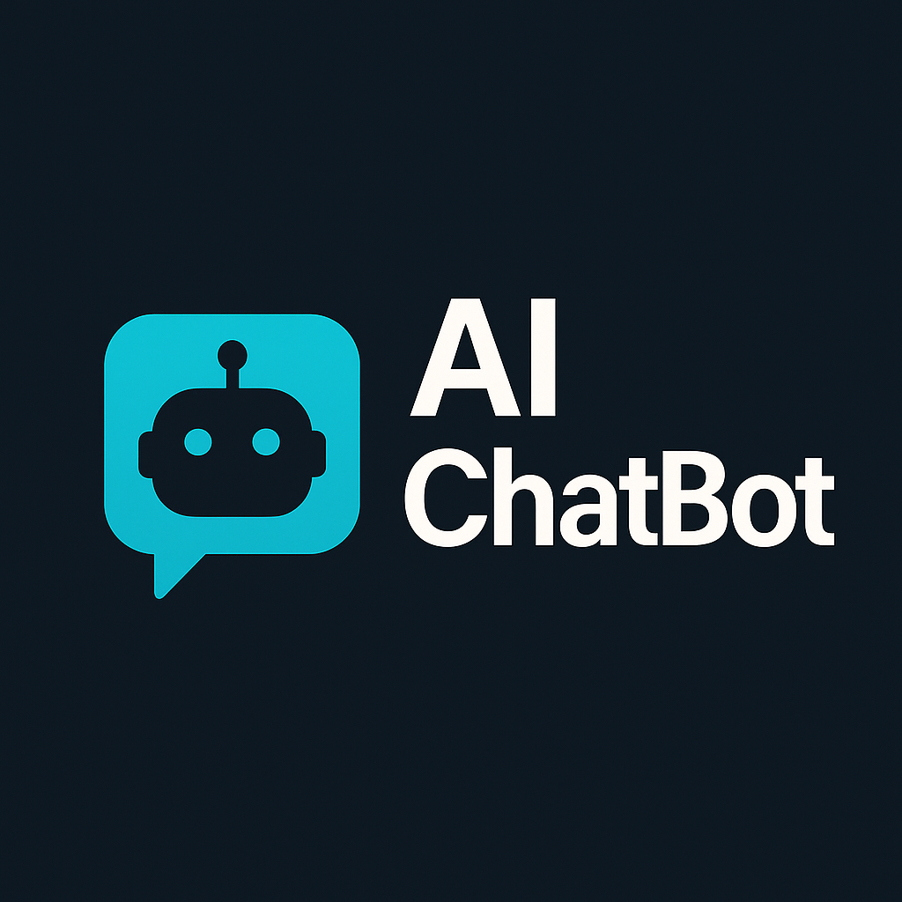
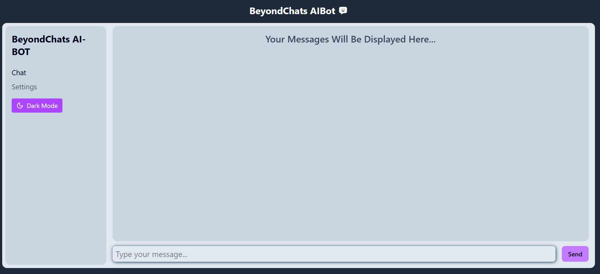

# 🤖 BeyondChats - AIBot (Free + Professional Grammar Based)

An AI-powered chatbot built with **React** and integrated with **OpenRouter** using the **Mistral 7B Instruct** model.  
It delivers grammatically correct and professional responses in real-time, with an elegant UI experience.

---

## ✨ Features

- 🔹 AI conversation with professional grammar
- 🔹 Realtime message update with loading indicator
- 🔹 User-friendly interface with dark mode
- 🔹 Responsive design with persistent chat history
- 🔹 Sidebar layout (optional future enhancement)
- 🔹 Customizable system prompt for bot tone
- 🔹 Free OpenRouter-based AI model integration

---

## 🖼️ Preview




---

## 🚀 Tech Stack

- **Frontend**: React.js, Tailwind CSS
- **Backend/API**: OpenRouter (Mistral 7B via Axios)
- **Deployment**: Vercel

---

## 📦 Project Setup Instructions

Follow these steps to run the project locally:

### 1. 📁 Clone the Repository

```bash
git clone https://github.com/Ayush-3012/beyondChats-aiBot
cd beyondChats-aiBot
```

### 2. 📥 Install Dependencies

```bash
npm install
```

### 3. 🔐 Set Environment Variables

Create a `.env` file in the root of the project and add the following:

```
VITE_API_KEY=your_openrouter_api_key
```

> 🔑 You can get a free API key from [https://openrouter.ai](https://openrouter.ai)  
> ✅ Enable the `mistralai/mistral-7b-instruct` model in your OpenRouter account.

### 4. 💻 Run the Development Server

```bash
npm run dev
```

Once running, open the app at:

```
http://localhost:5173/
```

---

## 👨‍💻 Author

- [Ayush Kumar](https://github.com/Ayush-3012)

---

## 🚀 About Me

I'm a MERN Stack Developer with a **B.Sc. (Hons.) in Computer Science** from **Dyal Singh College, Delhi University**.

Over the years, I've built a solid foundation in:

- 🔹 Programming Languages: **C++, JavaScript, Python**
- 🔹 Web Technologies: **HTML, CSS, MongoDB, Express.js, React.js, Node.js, Tailwind CSS**
- 🔹 Additional Interests: **Machine Learning**, **Data Science**

With a strong **8.8 CGPA**, I'm actively seeking **internships or full-time opportunities** where I can apply my knowledge, grow continuously, and contribute to impactful tech projects.

---

## 🛠 Skills

```text
C++, JavaScript, Python,
HTML, CSS, MongoDB,
Express.js, React.js, Node.js,
Tailwind CSS, REST APIs
```

---

## 🔗 Connect With Me

[](https://portfolio-ayush-3012.vercel.app/)
[](https://www.linkedin.com/in/ayush-kumar-6137651b4/)

---

## 📜 License

This project is licensed under the **MIT License** — feel free to use, modify, and share it!

---

## ✅ To-Do / Future Enhancements

- [x] Basic chat UI & message handling
- [x] Real-time response with loader
- [x] Grammar-enforced professional replies
- [ ] Sidebar layout with previous chats
- [ ] Save chat history (localStorage / DB)
- [ ] Admin panel for analytics (as per video)
- [ ] User authentication (multi-user support)
- [ ] Speech-to-text (voice input)

---

## 🙏 Acknowledgements

- [OpenRouter](https://openrouter.ai) — Free AI API
- [Mistral AI](https://mistral.ai) — Mistral 7B Instruct model
- [Tailwind CSS](https://tailwindcss.com)
- [React.js](https://reactjs.org)
